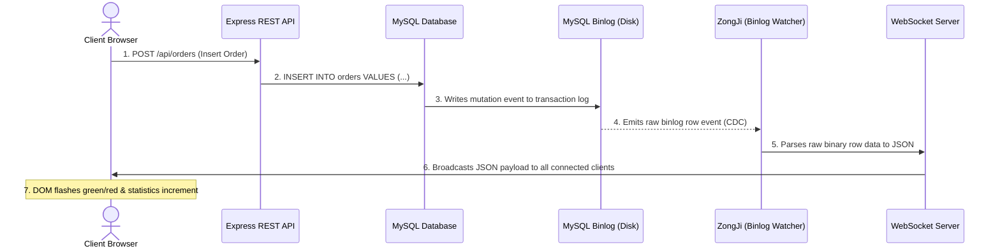

# APT Live Order Tracking System — External Reviewer Guide

This document acts as an architectural blueprint and system evaluation guide for external code reviewers, system architects, and assessors. It explains the design concepts, data pipeline flow, and technical implementation of the project.

---

## 💡 Core Design Concept

The APT Live Order Tracking System is a real-time trading dashboard designed to display transaction logs instantly as they are processed by the database. The system is engineered to achieve sub-50ms latency between a database transaction and its visual representation in the client's web browser, without using inefficient database polling.

### The Architectural Problem: Polling vs. Push
1. REST Polling (Old Approach): In a traditional model, the web client repeatedly sends `GET` requests to the database every 1–5 seconds to check for new rows. This causes high CPU usage, wastes database connections, and creates an artificial delay.
2. Change Data Capture (CDC - Our Approach): By tapping directly into the database's internal transaction log, the server listens for data changes immediately. It then pushes these events directly to the client's screen, ensuring zero database queries are made during monitoring.

---

## 🏗️ System Architecture & Data Flow

The project is built on a three-tier architecture: a client dashboard (frontend), an application server (backend), and a relational database (storage/logging).

### The Real-Time CDC Pipeline Flow:

1. User Action: The operator submits a manual order from the dashboard.
2. REST Write: The browser sends a `POST` request to `/api/orders`. The Express router validates the fields and executes an `INSERT` statement in MySQL.
3. Internal DB Write: MySQL commits the transaction to the database table and immediately records the row event to its binary log (binlog).
4. CDC Capture: The Node.js server has a running instance of `ZongJi` acting as a slave replica. It listens directly to the binary log stream and fires an event with the newly inserted/updated row data.
5. WebSocket Push: The server parses the event into clean JSON and immediately broadcasts the payload down all active WebSocket connections.
6. UI Render: The client browser receives the JSON object, updates the Order Book table dynamically with a green/red entry pulse, increments the top statistics cards, recalculates top gainers/losers, and adds a point to the live activity chart.

---

## 🛠️ Stack Profile

### 1. Database Layer: MySQL 8.0+ / 9.0+
* Configured with Row-Based Binary Logging (`binlog_format = ROW`).
* Persists order transactions, managing indices, and serving historical order batches.

### 2. Capture Layer: Change Data Capture (`@vlasky/zongji`)
* ZongJi mimics a MySQL slave server.
* Communicates using the MySQL replication protocol, parsing binary formats on the fly.
* Resolves modern authentication limitations using the `caching_sha2_password` protocol.

### 3. Server Layer: Node.js, Express & WebSockets (`ws`)
* Express: Serves frontend files and handles API REST calls.
* `ws` Server: Attaches to the same port as the Express server, providing a persistent, low-overhead TCP pipe to every connected client.

### 4. Client Layer: Glassmorphic UI & Ticker Engines
* HTML5 Canvas Background: Programmed to run a 60 FPS drifting candlestick animation using `requestAnimationFrame`, rendering wicks and waves without dragging main thread UI responsiveness.
* Chart.js: Dynamically displays a timeline chart plotting live transaction count spikes.
* Translucent CSS: Implemented using glassmorphic blurs (`backdrop-filter`) to integrate the visual elements seamlessly with the background canvas scene.
